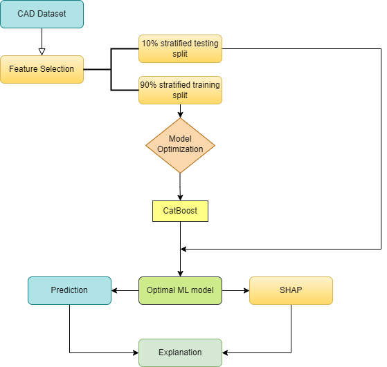
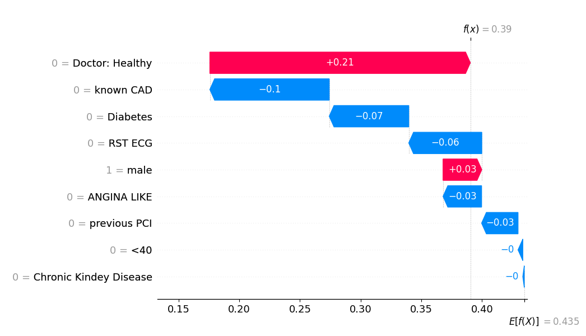
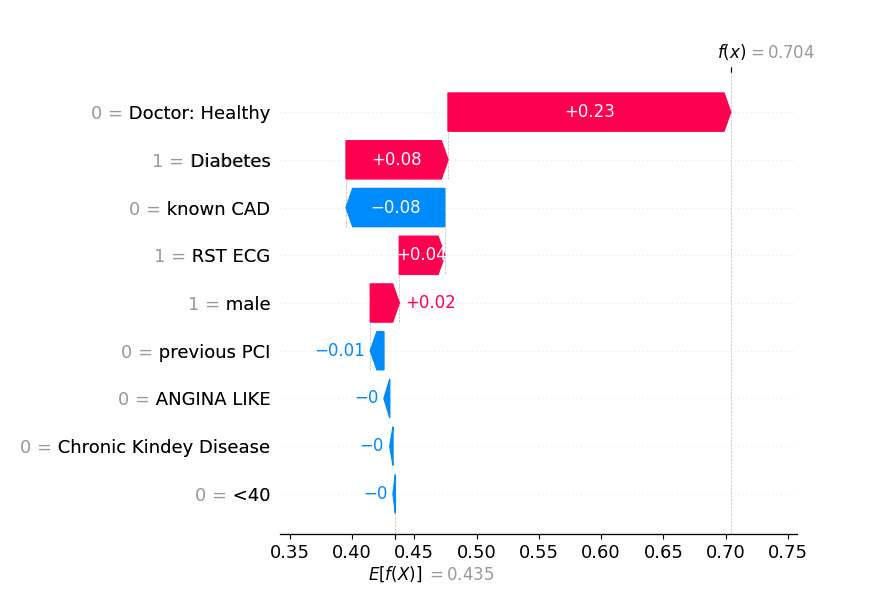

# EMERALD - ML
[](https://github.com/emeraldUTH/EMERALD-CAD-ML/)
[](README.md)
[](https://opensource.org/licenses/MIT)

This is the official <b>ML</b> implementation for CAD ML classification work showcased on 
["Classification models for assessing coronary artery disease instances using clinical and biometric data: an explainable man-in-the-loop approach"](https://www.nature.com/articles/s41598-023-33500-9) and 
["Uncovering the Black Box of Coronary Artery Disease Diagnosis: The Significance of Explainability in Predictive Models"](https://www.mdpi.com/2076-3417/13/14/8120).


## Papers' Abstract
These studies aim to develop and enhance computer-aided classification models for the prediction and diagnosis of coronary artery 
disease (CAD) by incorporating clinical data and expert opinions. Traditionally diagnosed through Invasive Coronary Angiography (ICA), 
CAD diagnosis has become a focal point for Medical Decision Support Systems (MDSS) utilizing machine learning (ML) and deep 
learning (DL) algorithms. These systems, however, often function as "black boxes," offering little transparency in how features 
are weighted and decisions are made. To address this, our research introduces a "man-in-the-loop" approach, integrating expert 
input into the ML prediction process to improve both accuracy and explainability.

Using a dataset of biometric and clinical data from 571 patients, including 43% ICA-confirmed CAD cases, multiple ML algorithms 
were applied with three different feature selection methods. The models were evaluated with and without expert diagnostic 
input using common metrics such as accuracy, sensitivity, and specificity. Stratified ten-fold cross-validation was performed, 
yielding a maximum accuracy of 83.02%, sensitivity of 90.32%, and specificity of 85.49% with expert input, 
compared to 78.29%, 76.61%, and 86.07% without it.

Additionally, we applied state-of-the-art explainability techniques to explore the feature-weighting process of a CatBoost algorithm, 
comparing the findings to established medical literature and common CAD risk factors. This dual focus on performance and transparency 
enhances trust and confidence in the diagnostic process, illustrating the importance of human expertise in the development of ML-driven 
CAD diagnosis tools. The study demonstrates the potential of combining machine learning with expert opinion to both improve CAD diagnosis 
accuracy and shed light on the "black-box" nature of prediction models.

## Usage

The **Explainable CAD Prediction Framework** is designed to provide transparent and interpretable machine learning models for diagnosing 
CAD based on clinical and biometric data. This framework integrates **expert opinion** and **SHAP explainability techniques** 
to offer both qualitative and quantitative insights into the decision-making process.

### Key Features
- **Expert-in-the-loop Predictions**: This framework incorporates expert judgments into the model's feature pool, improving accuracy and highlighting the impact of expert input on CAD diagnosis.
- **Explainability**: SHAP values are used to illustrate the importance of individual features in the prediction process, providing transparency and interpretability for clinicians and researchers.
- **Feature Selection Optimization**: Utilizing **Genetic Algorithms (GA)** and **Sequential Feature Selection (SFS)**, the framework selects the optimal subset of features to improve model performance.
- **Comprehensive Performance Evaluation**: The framework supports the evaluation of five machine learning algorithms using **stratified 10-fold cross-validation**, ensuring robust assessment across multiple models.

### Example Interpretations
The framework provides **qualitative interpretations** for each prediction, explaining how each feature contributes to the final diagnosis through SHAP value analysis. Below is an example of SHAP-based explanations for an individual patient:



The **quantitative interpretations** can be used to construct dataset-level insights, identifying the most important clinical features for CAD diagnosis. Below are examples of SHAP waterfall plots for healthy and CAD patients:





### Contributions
1. **Incorporating expert judgment**: The framework leverages the expert’s diagnostic input as a feature and compares the model’s performance with and without it.
2. **Optimal feature selection**: Through GA and SFS methods, it identifies the most effective feature set to maximize diagnostic accuracy.
3. **Performance benchmarking**: It evaluates five popular machine learning algorithms across various metrics to select the best-performing model.
4. **Enhanced explainability**: SHAP values are employed to demystify the prediction process and validate the model against common CAD risk factors.

The **Explainable CAD Prediction Framework** ensures transparency in medical decision-making by allowing clinicians to understand and trust the AI's reasoning process.

An example of usage for EMERALD-CAD-ML is shown below:

```python
from sklearn.ensemble import RandomForestClassifier

# Initialize the model
rndF = RandomForestClassifier(max_depth=None, random_state=0, n_estimators=80)
```

The `rndF` defines the initilization for the specific ML model used (in this case **Random Forest**). In our implementation
`n_estimators` defines the number of estimators employed by the algorithm.

### Training

An example of the training process is provided in the `ml_script.py` script. The `ml_script.py` script can be used to train an
ML model given a set of training dataset. The `ml_script.py` script can be used as follows:

```python
data_path = 'path_to_csv'
data = pd.read_csv(data_path)
dataframe = pd.DataFrame(data.values, columns=data.columns)
dataframe['CAD'] = data.CAD
x = dataframe.drop(['ID','female','CNN_Healthy','CNN_CAD','Doctor: CAD','HEALTHY','CAD'], axis=1) # Whether to drop labels from the index (0 or ‘index’) or columns (1 or ‘columns’).
x_nodoc = dataframe.drop(['ID','female','CNN_Healthy','CNN_CAD','Doctor: CAD', 'Doctor: Healthy','HEALTHY','CAD'], axis=1) # Whether to drop labels from the index (0 or ‘index’) or columns (1 or ‘columns’).
y = dataframe['CAD'].astype(int)

sel_alg = rndF

#############################################
#### Genetic Algorithm Feature Selection ####
#############################################
for i in range (0,3):
    print("run no ", i, ":")
    selector = GeneticSelectionCV(
        estimator=sel_alg,
        cv=10,
        verbose=2,
        scoring="accuracy", 
        max_features=26, #TODO change to 27 when testing with doctor, 26 without
        caching=True,
        n_jobs=1)
    selector = selector.fit(x, y)
    n_yhat = selector.predict(x)
    sel_features = x.columns[selector.support_]
    print("Genetic Feature Selection:", x.columns[selector.support_])
    print("Genetic Accuracy Score: ", selector.score(x, y))
    print("Testing Accuracy: ", metrics.accuracy_score(y, n_yhat))

    ###############
    #### CV-10 ####
    ###############
    for feature in x.columns:
        if feature in sel_features:
            pass
        else:
            X = X.drop(feature, axis=1)
    
    print("cv-10 accuracy: ", cross_val_score(sel_alg, X, y, scoring='accuracy', cv = 10).mean() * 100)

sel_features = doc_rdnF_80_none

##############
### CV-10 ####
##############
for feature in x.columns:
    if feature in sel_features:
        pass
    else:
        X = X.drop(feature, axis=1)

est = sel_alg.fit(X, y)
n_yhat = est.predict(X)

print("cv-10 accuracy: ", cross_val_score(sel_alg, X, y, scoring='accuracy', cv = 10).mean() * 100)
print("cv-10 accuracy STD: ", cross_val_score(sel_alg, X, y, scoring='accuracy', cv = 10).std() * 100)
print("f1_score: ", cross_val_score(sel_alg, X, y, scoring='f1', cv = 10).mean() * 100)
print("f1_score STD: ", cross_val_score(sel_alg, X, y, scoring='f1', cv = 10).std() * 100)
print("jaccard_score: ", cross_val_score(sel_alg, X, y, scoring='jaccard', cv = 10).mean() * 100)
print("jaccard_score STD: ", cross_val_score(sel_alg, X, y, scoring='jaccard', cv = 10).std() * 100)
scoring = {
    'sensitivity': metrics.make_scorer(metrics.recall_score),
    'specificity': metrics.make_scorer(metrics.recall_score,pos_label=0)
}
print("sensitivity: ", cross_val_score(sel_alg, X, y, scoring=scoring['sensitivity'], cv = 10).mean() * 100)
print("sensitivity STD: ", cross_val_score(sel_alg, X, y, scoring=scoring['sensitivity'], cv = 10).std() * 100)
print("specificity: ", cross_val_score(sel_alg, X, y, scoring=scoring['specificity'], cv = 10).mean() * 100)
print("specificity STD: ", cross_val_score(sel_alg, X, y, scoring=scoring['specificity'], cv = 10).std() * 100)
```

It is recomended to save the trained model and subset using either the `dump` function. For example:

```python
joblib.dump(est, f'{sel_alg}_model.joblib')
```

### Interpretations

An example of the training process is provided in the `ml_xai.py` script. The `ml_xai.py` script can be used to explain
the model stored by the `ml_script.py` script. The `ml_script.py` script can be used as follows:

```python
# best performing subset
doc_rdnF_80_none = ['known CAD', 'previous PCI', 'Diabetes', 'Chronic Kindey Disease', 'ANGINA LIKE', 'RST ECG', 'male', '<40', 'Doctor: Healthy'] # rndF 84,41% -> cv-10: 83,02%

sel_features = doc_rdnF_80_none
for feature in x.columns:
    if feature in sel_features:
        pass    
    else:
        X = X.drop(feature, axis=1)

est = sel_alg.fit(X, y)
n_yhat = cross_val_predict(est, X, y, cv=10)
print("Testing Accuracy: {a:5.2f}%".format(a = 100*metrics.accuracy_score(y, n_yhat)))

print("###### SHAP ######")
# print('Number of features %d' % len(est.feature_names_in_))
effect_sizes = cohen_effect_size(X, y)
effect_sizes.reindex(effect_sizes.abs().sort_values(ascending=False).nlargest(40).index)[::-1].plot.barh(figsize=(6, 10))
plt.title('Features with the largest effect sizes')
plt.show()

xai(est, X, 0)
```

## Citation
If you find this work useful, please cite our papers:

```
@article{Samaras2023classification,
  title = {Classification models for assessing coronary artery disease instances using clinical and biometric data: an explainable man-in-the-loop approach},
  author = {Samaras, Agorastos-Dimitrios and Moustakidis, Serafeim and Apostolopoulos, Ioannis D. and Papandrianos, Nikolaos and Papageorgiou, Elpiniki},
  journal = {Scientific Reports},
  volume = {13},
  number = {1},
  pages = {6668},
  year = {2023},
  publisher = {Nature Publishing Group UK London},
  doi = {10.1038/s41598-023-33500-9},
  url = {https://doi.org/10.1038/s41598-023-33500-9}
}
```

```
@article{Samaras2023uncovering,
  title = {Uncovering the Black Box of Coronary Artery Disease Diagnosis: The Significance of Explainability in Predictive Models},
  author = {Samaras, Agorastos-Dimitrios and Moustakidis, Serafeim and Apostolopoulos, Ioannis D. and Papageorgiou, Elpiniki and Papandrianos, Nikolaos},
  journal = {Applied Sciences},
  volume = {13},
  number = {14},
  year = {2023},
  doi = {10.3390/app13148120},
  url = {https://doi.org/10.3390/app13148120},
  issn = {2076-3417}
}
```
